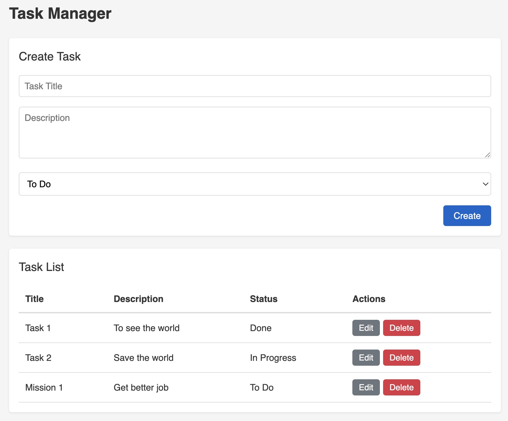

# CRUD-Demo

A demonstration project showcasing basic CRUD (Create, Read, Update, Delete) operations implemented with the ability to switch between different backend frameworks, databases, and API patterns while maintaining a consistent frontend. This repository features minimalistic code and package usage, designed for interview scenarios and code tests.

- @Author: Steven Luo
- @Email: steven@xiluo.net

## Website Layout

## TO DO
1) Django
2) GraphQL
3) Vue.js

## System Architecture

- **Backend Options**: 
  - .NET Core
  - Node.js/Express
  - Django
- **Frontend Options**: 
  - React with TypeScript
  - Angular with TypeScript
- **Database Options**: 
  - MySQL
  - MongoDB
  - JSON
  - SQLite
- **API Options**: 
  - RestAPI
  - GraphQL

## API Endpoints

| Method | Endpoint | Description |
|--------|----------|-------------|
| GET | /api/task | Retrieve all tasks |
| GET | /api/task/:id | Retrieve a specific task by ID |
| POST | /api/task | Create a new task |
| PUT | /api/task/:id | Update an existing task |
| DELETE | /api/task/:id | Delete a task |

## Task Model

**Each task contains:**
- Title (string)
- Description (text)
- Status (To Do, In Progress, Done)
- Created and updated timestamps

## Documentation

- Backend
  - Dotnet
      - [.NET Backend and JSON Documentation](dotnet-json/README.md)
      - [.NET Backend and MySQL Documentation](dotnet-mysql/README.md)
      - [.NET Backend and MongoDB Documentation](dotnet-mongodb/README.md)
  - Django
      - [Django Backend](django/README.md)
  - Node.js
      - [Node.js Backend Documentation](nodejs-back/README.md)
- Frontend
  - React
    - [React Frontend Documentation](react-front/README.md)

## Purpose

This project demonstrates how the same functionality can be implemented across different backend frameworks while maintaining identical API interfaces and frontend interactions. It serves as a practical comparison of implementation patterns across technologies.