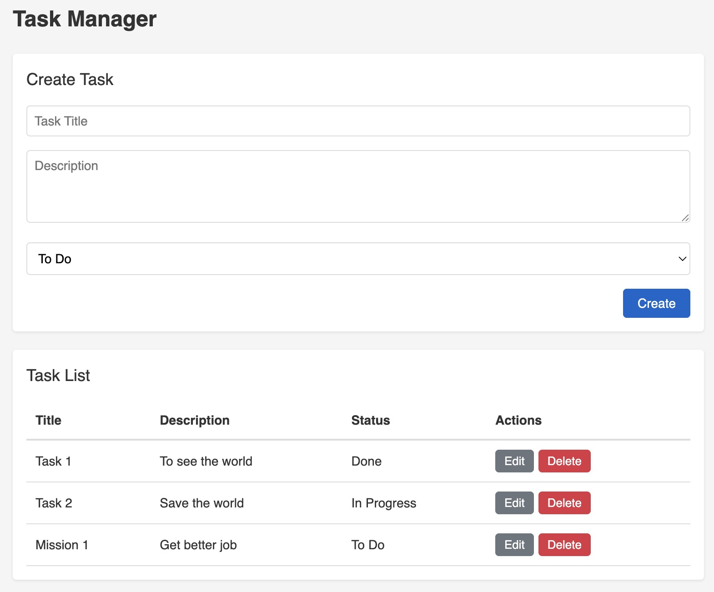

# CRUD-Demo

A demonstration project showcasing basic CRUD (Create, Read, Update, Delete) operations implemented with the ability to switch between different backend frameworks, databases, and API patterns while maintaining a consistent frontend. This repository features minimalistic code and package usage, designed for interview scenarios and code tests.

- @Author: Steven Luo
- @Email: steven@xiluo.net

## Website Layout


## TO DO
1) Vue.js 

## System Architecture

- **Backend Options**: 
  - .NET Core
  - Node.js/Express
  - Django
- **Frontend Options**: 
  - React with TypeScript
  - Angular with TypeScript
- **Database Options**: 
  - MySQL 
  - MongoDB
    - Django Limited
  - JSON 
    - Node.js and .NET only
  - SQLite 
    - Django Only
  - In-Memory Database 
    - .NET Only

- **API Options**: 
  - RestAPI
  - GraphQL (Node.js Only)

## API Endpoints

| Method | Endpoint | Description |
|--------|----------|-------------|
| GET | /api/task | Retrieve all tasks |
| GET | /api/task/:id | Retrieve a specific task by ID |
| POST | /api/task | Create a new task |
| PUT | /api/task/:id | Update an existing task |
| DELETE | /api/task/:id | Delete a task |

## Task Model

**Each task contains:**
- Title (string)
- Description (text)
- Status (To Do, In Progress, Done)
- Created and updated timestamps

## Documentation

- Backend
  - Dotnet
      - [.NET Backend and In-Memory DB Documentation](dotnet-inmemorydb/README.md)
      - [.NET Backend and JSON Documentation](dotnet-json/README.md)
      - [.NET Backend and MySQL Documentation](dotnet-mysql/README.md)
      - [.NET Backend and MongoDB Documentation](dotnet-mongodb/README.md)
  - Django
      - [Django Backend Basic](django-basic/README.md)
      - [Django Backend with Rest Framework Package](django-restframework/README.md)
  - Node.js
      - [Node.js Backend Documentation](nodejs-back/README.md)
- Frontend
  - React
    - [React Frontend Documentation](react-front/README.md)
  - Angular
    - [Angular Frontend Documentation](angular-front/README.md)

## Purpose

This project demonstrates how the same functionality can be implemented across different backend frameworks while maintaining identical API interfaces and frontend interactions. It serves as a practical comparison of implementation patterns across technologies.

## About Docker
``` bash
# Create container for all services
docker compose up --build

# Create container based on the DockeFile
docker compose -f docker-compose.yml up --build
docker compose -f docker-compose.mongodb.yml up --build
docker compose -f docker-compose.mysql.yml up --build

# Force Recreate
docker compose -f docker-compose.mongodb.yml up -d --build --force-recreate

# Create container for signle service
cd .\dotnet-inmemorydb\
# Create Image
docker build -t dotnet-inmemorydb:latest .
# Run the Container
docker run -d --name dotnet-inmemorydb -p 8888:8888 -e ASPNETCORE_ENVIRONMENT=Production dotnet-inmemorydb:latest

# Push the image into Docker Hub
# Login
docker login
# Build Image
docker build -t <Your Username>/dotnet-inmemorydb:v1 -t <Your Username>/dotnet-inmemorydb:latest .\
docker build -t luoxisteven/dotnet-inmemorydb:latest .

# Push Images
docker push <Your Username>/dotnet-inmemorydb:v1
docker push luoxisteven/dotnet-inmemorydb:latest


docker build -t luoxisteven/dotnet-mongodb:v2 .
docker push luoxisteven/dotnet-mongodb:v2

# Push Image to the Lightsail container service
aws lightsail push-container-image --region <Region> --service-name <ContainerServiceName> --label <ContainerImageLabel> --image <LocalContainerImageName>:<ImageTag>

aws lightsail push-container-image --region ap-southeast-2 --service-name testing --label dotnet-inmemorydb --image luoxisteven/dotnet-inmemorydb:latest
```

## About k8s
``` bash
# Apply yaml to k8s
kubectl apply -f k8s/dotnet-mongodb.yaml -n zhhen-dev

# Delete yaml file from namespace
kubectl -n zhhen-dev delete -f k8s/dotnet-mongodb.yaml
```

## Setting up Custom Domain for Container:
1) Create a SSL/TLS Certificate
2) Setting up a CNAME record for the SSL/TLS Certificate
3) Setting up another CNAME record for your domain and the default domain
